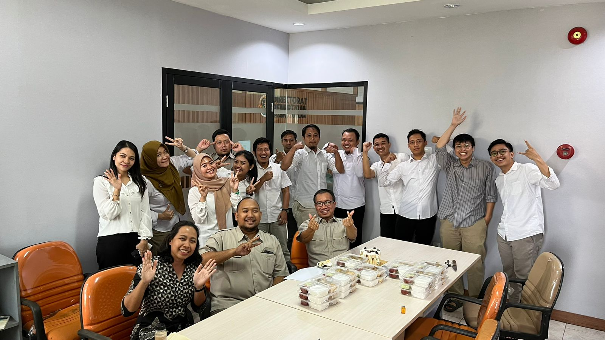

## Introduction

Hello, ini Subdit Penertiban Wilayah 1

## Anggota

Beranggotakan

1. Yunianto Rahadi Utomo -- Kasubdit Penertiban Wilayah 1
2. Pipit Ardhi Putri -- Kordinator Penertiban Wilayah 1
3. Virgeovani Hermawan--
4. Yogi Ananto--
5. Ferdinan Aurifio--
6. Rizky Fitriananda
7. Arum Nawang Wulan
8. Putu Maeta Maharani
9. Hasbi Asidiqi
10. Andi Rachman
11. Kurniawan Suhendra
12. Bayu Adrian MP
13. M. Iqbal Basar
14. Badar Jamaludin
15. Jumali

## Portofolio

Dalam kegiatan di Tahun 2023 ini, fokus kegiatan berada pada:

- Kasus Kawasan Mega Mendung Lembah Anai (hyperlink ke respositories kusus)
- Penyidikan Batam
-
-
-

## Data Pelanggaran Pemanfaatan Ruang

| Kabupaten/Kota | Jumlah Pelanggaran | Tahap penanganan |
| -------------- | :----------------: | ---------------: |
| Palembang      |        400         |                4 |
| Kota Batam     |        200         |               20 |
| Lampung        |        100         |               10 |
